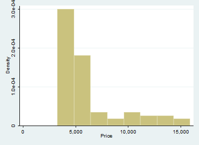

Introduction to MarkDoc (heading 1)
===================================

Using Markdown (heading 2)
--------------------------

Writing with **markdown** syntax allows you to add text and graphs to
*smcl* logfile and export it to a editable document format. I will
demonstrate the process by using the **Auto.dta** dataset.

### Get started with MarkDoc (heading 3)

I will open the dataset, list a few observations, and export a graph.
Then I will export the logfile to Microsoft Office docx format.

          . sysuse auto, clear
          
               +---------------------------------------------------------------------------------+
            1. | make          | price | mpg | rep78 | headroom | trunk | weight | length | turn |
               | AMC Concord   | 4,099 |  22 |     3 |      2.5 |    11 |  2,930 |    186 |   40 |
               |---------------------------------------------------------------------------------|
               |         displa~t         |         gear_r~o         |          foreign          |
               |              121         |             3.58         |         Domestic          |
               +---------------------------------------------------------------------------------+
          
               +---------------------------------------------------------------------------------+
            2. | make          | price | mpg | rep78 | headroom | trunk | weight | length | turn |
               | AMC Pacer     | 4,749 |  17 |     3 |      3.0 |    11 |  3,350 |    173 |   40 |
               |---------------------------------------------------------------------------------|
               |         displa~t         |         gear_r~o         |          foreign          |
               |              258         |             2.53         |         Domestic          |
               +---------------------------------------------------------------------------------+
          
               +---------------------------------------------------------------------------------+
            3. | make          | price | mpg | rep78 | headroom | trunk | weight | length | turn |
               | AMC Spirit    | 3,799 |  22 |     . |      3.0 |    12 |  2,640 |    168 |   35 |
               |---------------------------------------------------------------------------------|
               |         displa~t         |         gear_r~o         |          foreign          |
               |              121         |             3.08         |         Domestic          |
               +---------------------------------------------------------------------------------+
          
               +---------------------------------------------------------------------------------+
            4. | make          | price | mpg | rep78 | headroom | trunk | weight | length | turn |
               | Buick Century | 4,816 |  20 |     3 |      4.5 |    16 |  3,250 |    196 |   40 |
               |---------------------------------------------------------------------------------|
               |         displa~t         |         gear_r~o         |          foreign          |
               |              196         |             2.93         |         Domestic          |
               +---------------------------------------------------------------------------------+
          
               +---------------------------------------------------------------------------------+
            5. | make          | price | mpg | rep78 | headroom | trunk | weight | length | turn |
               | Buick Electra | 7,827 |  15 |     4 |      4.0 |    20 |  4,080 |    222 |   43 |
               |---------------------------------------------------------------------------------|
               |         displa~t         |         gear_r~o         |          foreign          |
               |              350         |             2.41         |         Domestic          |
               +---------------------------------------------------------------------------------+
          
          .      histogram price
          (bin=8, start=3291, width=1576.875)
          
          
          .      graph export graph.png,  width(400) replace
          (file graph.png written in PNG format)
          
          

You use two stars to include only output, and three stars to include
only the command. So two stars plus "quietly" gets you nothing. You can
also add numbers inline, but it's not quite as smooth as in R Markdown.

Because you put it on the next command line to say the mean of Price
variable is 6165.26 and SD is 2949.50

Adding a graph or image in the report
=====================================

Adding a graph using Markdown
-----------------------------

In order to add a graph using Markdown, I export the graph in PNG
format. You can explain the graph in the "brackets" and define the file
path in parentheses

You can also export to a ton of different file types. (Thanks, pandoc!)
So that's actuall y kind of cool.

Let's try and add math at the bottom. $y_i=\alpha+\beta_1*X_i$

